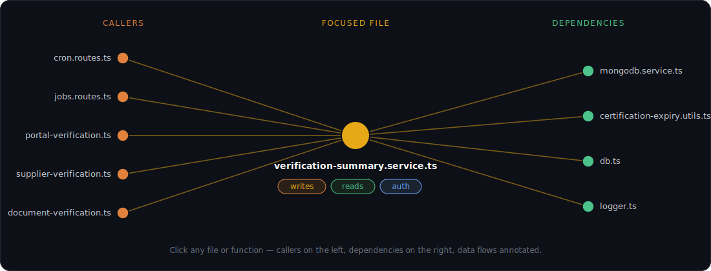

<div align="center">

# 🗺️ codeflowmap

### Map your codebase's **dependencies** and **data flows** — what writes, what reads, what's behind auth.

<p align="center">
  <a href="https://www.npmjs.com/package/codeflowmap"></a>
  <a href="LICENSE"></a>
  
  
</p>

<p align="center">
  <em>Deterministic static analysis builds the graph; an open-weight LLM adds the semantic layer.</em>
</p>

<!-- Swap this for a real demo gif/png whenever you grab one (scan → graph → focus → annotate). -->
<p align="center">
  
</p>

```bash
bunx codeflowmap serve        # → http://localhost:4321 · no install, no clone
```

</div>

---

## Why this exists

I wanted to get better at reading code I didn't write. Two kinds, really. The first: understanding the code an LLM wrote for me. Generating it is the fast part. Getting across what it actually did (what it touched, what it reads and writes, whether the auth path is where I think it is) was the gap I needed to fix. This tool is my way of improving the verification step. Generate, then graph it and see what's really there.

The second is dropping into an unfamiliar repo and tracing how it stitches together, what calls what, where data gets written, which paths run through auth. Slow work, and easy to get wrong when it's not your local playground. This part is all about learning good patterns from people who know what they're doing.

It's experimental because it was built to be useful to me first, not to be a finished product. If it helps you better understand a codebase the same way, good.

---

## What you get

|  |  |
|---|---|
| 🔗 **Exact dependency graph** | File-level imports resolved by the TypeScript compiler (aliases, barrels, index files) — not guessed. |
| 🔁 **Function-level call graph** | Who calls what, symbol to symbol. Toggle between the **Files** and **Functions** views. |
| 🧭 **Focus any node** | Click (or search) a file/function → a clean, directional view: callers on the left, dependencies on the right. Big neighbourhoods collapse by directory. |
| 🧠 **Semantic layer (optional)** | An LLM annotates each file: a summary plus **writes / reads / config / auth / flows** — the meaning the graph can't infer. |
| 🧾 **Flow-trace** | Aggregates the data footprint across a whole capability: *"this route writes these tables, reads these, is gated by this auth."* |
| 📓 **Obsidian-linkable vault** | One `.md` per file with `[[wikilinks]]` that are real edges — open the output folder as an Obsidian vault for free. |

---

## Quick start

```bash
bunx codeflowmap serve        # opens http://localhost:4321
```

Then, in the browser:

1. **Scan** — click **Browse…** to pick a folder (or type/paste a path; `~` works), then **Scan**. The import graph, call graph, and Obsidian vault are written to `<repo>/.codemap`.
2. **Annotate** *(optional)* — add the semantic layer. Leave the key blank to run locally via **Ollama**, or paste an **API key** + base URL for any OpenAI-compatible provider (Mistral, OpenAI, …).
3. **Explore** — toggle **Files / Functions**, click a node to focus its neighbourhood and highlight up/downstream paths, search to jump anywhere, and filter by data-flow type.

Open the same `.codemap/` folder as an Obsidian vault for the graph view + backlinks.
Add `.codemap/` to your `.gitignore` if you don't want it committed.

---

## How it works

```
AST / static analysis  →  import graph + function-level call graph    (deterministic, no tokens)
        ↓
   LLM annotation        →  writes / reads / config / auth / flows     (provider-agnostic; default: local Ollama)
        ↓
   Markdown vault        →  one .md per file, [[wikilinks]] = real edges   (link into Obsidian)
        ↓
   Web UI                →  Files / Functions views, focus + flow-trace, filter by flow
```

> **Graph edges are never inferred by the LLM.** Imports come from real module resolution and call edges from symbol resolution (TypeScript Compiler API), so they're exact, free, and CI-reproducible. The model only adds the semantic layer.

---

## Requirements

- [**Bun**](https://bun.sh) ≥ 1.0 — the runtime (the tool uses Bun's built-in server).
- *(optional, for annotation)* a local [**Ollama**](https://ollama.com) install **or** an API key for any OpenAI-compatible provider. The graph itself needs no model.

---

<details>
<summary><b>Scriptable / CI usage</b> — the same operations as plain CLI commands</summary>

<br>

```bash
bun run codemap scan ./repo -o .codemap            # graph + vault, deterministic, no tokens
ollama pull qwen2.5-coder:7b                        # one-time, ~4.7 GB
bun run codemap annotate -o .codemap               # local Ollama (default)
bun run codemap annotate -o .codemap -p mistral    # Mistral API (needs CODEMAP_API_KEY)
```

Annotations are cached by file-content hash under `.codemap/.cache`, so re-runs only re-send changed files.

</details>

<details>
<summary><b>Annotation providers & data egress</b> — read before annotating real code</summary>

<br>

> ⚠️ **Data egress:** annotating sends the **full contents of every scanned file** to the configured provider. With `mistral` / `openai` (or any remote `--base-url`) your source code leaves the machine and is processed by a third party — don't annotate proprietary or sensitive code against a remote provider without authorization. For a fully local workflow that sends nothing off-box, use the default **`ollama`** provider.

| Provider | Endpoint | Default model | Key |
|----------|----------|---------------|-----|
| `ollama` (default) | `http://localhost:11434/v1` | `qwen2.5-coder:7b` | none (local) |
| `mistral` | `https://api.mistral.ai/v1` | `devstral-small-2512` | `CODEMAP_API_KEY` / `MISTRAL_API_KEY` |
| `openai` | `https://api.openai.com/v1` | `gpt-4o-mini` | `CODEMAP_API_KEY` / `OPENAI_API_KEY` |

Env overrides: `CODEMAP_PROVIDER`, `CODEMAP_MODEL`, `CODEMAP_BASE_URL`, `CODEMAP_API_KEY`. Any OpenAI-compatible endpoint works via `--base-url`. Secrets are read **only** from the environment — never written to the vault, `graph.json`, the cache, or logs.

**Model sizing:** `qwen2.5-coder:7b` (~4.7 GB, Apache-2.0) is the default — it runs on a 16 GB laptop and the per-file task doesn't need more. For higher-quality summaries on a 32 GB+ machine, use `-m devstral` (24B). For 8 GB, `-m qwen2.5-coder:3b`.

</details>

---

## Status

| | Capability | State |
|---|---|---|
| ✅ | Import graph (TS/JS via ts-morph) → `graph.json` + Obsidian vault | done |
| ✅ | Tree-sitter Python extractor (imports + symbols) | done |
| ✅ | Function-level call graph for TS/JS (**Functions** view) | done |
| ✅ | LLM annotation — provider-agnostic, local-first | done |
| ✅ | Web UI (Cytoscape): focus, directory grouping, flow-trace | done |
| 🔜 | Function-level call edges for Python | planned |

> **Early / experimental** — interfaces and output format may change. Python currently contributes import edges + symbols; function-level call edges are TS/JS only.

---

## Development

```bash
git clone https://github.com/man-consult/code-mapper.git && cd code-mapper
bun install
bun run codemap serve          # runs from source; builds the UI on first run
```

Monorepo (Bun workspaces): `packages/core` (graph extraction) · `packages/annotate` (LLM layer) · `packages/cli` (the `serve` command) · `packages/web` (Cytoscape UI). `bun run build:pkg` assembles the publishable npm package into `pkg/`.

---

## License

[MIT](LICENSE) © 2026 Brian Mangano
